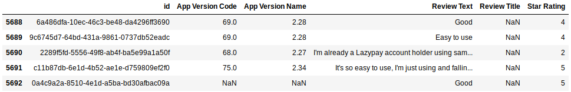
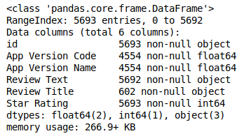
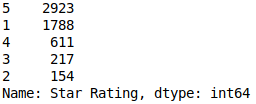
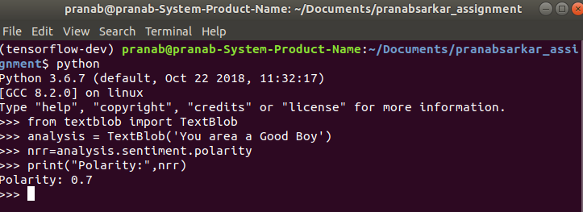
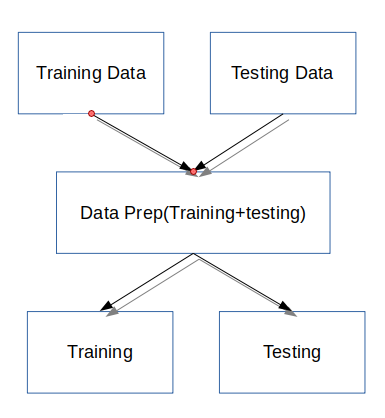

# Attributes2Ratings

In this assignment I have used python as my language.

The `requirements.txt` file should list all Python libraries that your script depend on, and they will be installed using

```
pip install -r requirements.txt
```

The usage of the code presented below:

Loading the Data set for training and testing

````python
df_train=pd.read_csv("train.csv")
df_test=pd.read_csv("test.csv")
````

loading the data..

# 







After the analysis I have noticed the following:

1.   There are many **NaN** values.
2.   The data is not balanced. (**Star Rating**) 
3.   The text data is not clean. (**Review Text**) 

Thus, I will use the entire data as well as create some synthetic data to balance the dataset for training my model.

# Steps:

## 1. Data Processing

After cleaning the text data I have used **TextBlob** to calculate the polarity of the sentences. In the given data-set there 2 columns which contains text data. Thus in the following points I will explain how I have managed those columns-

**1. Review Text:**  I have created a new column ***senti* ** to store the polarity values with respect to the review text.

**2. Review Title:**   I have created a new column ***senti_2* ** to store the polarity values in 3 classes happy, neutral and sad with respect to the review title. Here the NaN rows are replaced with the string *empty3*.



 										   *An example to find out the polarity using textblob.*


The NaN rows inside the columns *App Version Code* and *App Version* Name are replaced with *empty1* and *empty2*.

I will join the training the training and testing data to prepare the data. As I am dealing mainly with categorical data I will one hot encode them into different columns. When the data is one hot encoded into columns the training and testing data is now separated and are ready for their main objectives. 



## 2. Creating the synthetic data to balance the data-set and training the model.

As the data is totally imbalanced with respect to the different classes of the Star Ratings, I will use **SMOTE** to up-sample the data. After the data is up-sampled it is split into **75:25 ratio** to train the model with **RandomForestClassifier**.

## 3. Creating the Submission File.

The model is now trained and the test data-set can be fed to get the predictions. The predictions are saved into the *sample_submission.csv* file with their respective id number. 

> Classification Report and Confusion Matrix generated after training and testing our model from the test.csv.


## Running the python script

Type the following inside the terminal to generate the submission file.

```
python src/main.py
```


